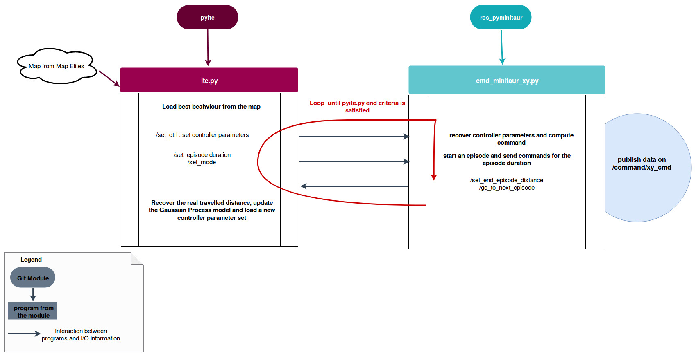
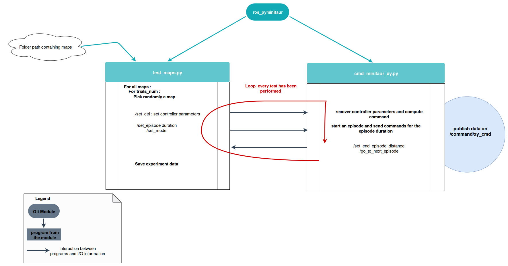

# Ros Pyminitaur
Ros pyminitaur is a ros package containing ros nodes to interact with the minitaur through ros

You will first need to install and run the CommandRobotRosXY example avalaible [here](https://github.com/resibots/minitaur_sdk.git)

For more details please check the [minitaur_framework](https://github.com/resibots/minitaur_framework.git)

Clone this repository and run :

``git submodule update --init --recursive``

## What nodes are availables ?

* ``` cmd_minitaur_simple.py ```

This node allows you to load the best parameter set found in a map_elites map and to send the command to the minitaur through the  ``` /command/xy_cmd ``` topic

* ``` test_maps.py```

This node allows you to test x behaviours from n maps and save the results (real travelled distance)
You need to specify a path containing map_elites maps as an argument. Note that you first need to launch vrpn_optitrack_minitaur.launch in order for this to work.


This specific file tree organisation needs to be respected for n maps :

- path_to_folder_containing_maps/
  - 1/
    - centroid_file
    - archive_file
  - 2/
    - centroid_file
    - archive_file
  - ../

  - n/
    - centroid_file
    - archive_file


* ``` cmd_minitaur_xy.py ```

This node is used to run episodes on the minitaur. Note that you first need to launch vrpn_optitrack_minitaur.launch in order for this to work.

This node works thanks to the following services :

```
/odom_transform_restart
/set_ctrl
/set_episode_duration
/set_mode
/set_end_episode_distance
/go_to_next_episode
```

``` /set_ctrl ``` Set the parameters of the controller defined in pycontrollers/controller.py.
For one leg, one signal from controller.py is the x cartesian command and another signal is the y cartesian command.

``` /set_episode_duration ``` set the duration of one episode in seconds

``` /set_mode ``` 1 to start running an episode and 0 to stop it

``` /set_end_episode_distance ``` This service is defined in [pyite](https://github.com/resibots/pyite.git) and test_maps.py. At the end of an episode the distance travelled by the minitaur is recovered by vrpn and sent to either pyite.py or test_maps.py.


``` /go_to_next_episode ``` This service is defined in [pyite](https://github.com/resibots/pyite.git) and test_maps.py. It tells pyite.py or test_maps.py that the current episode is finished and that we can move to a new episode if needed.

``` /odom_transform_restart ``` At the beginning of a new episode this service is called to create an odom static tf frame that is the minitaur starting point. It is then used later to determined the minitaur relative position at the end of each episode. This service is launched inside odom_transform.py and through vrpn_optitrack_minitaur.launch .

You can see below a graphical overview of how it can be used with [pyite](https://github.com/resibots/pyite.git)  :



This node can also be used with ``` test_maps.py ```


